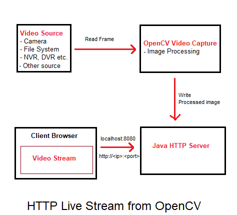

[English](./README.md) | Türkçe

<div align="center">


<h1 align="center">OpenCV ile HTTP Üzerinden Video Stream</h1>

</div>


OpenCV ile video kaynağından (Kamera, Dosya Sistemi, NVR, DVR vb.) okunan ve işlenen görütüyü, http protokolü üzerinden yayınlayan örnek bir projedir. OpenCV 3.1 sürümü kullanılmıştır. Projenin mimarisini aşağıda görebilirsiniz.


### Mimari

<div align="center">

</div>


### Bağımlılıklar

 - OpenCV 3+
 - Java 6+


### Nasıl çalıştırılır


```sh
System.loadLibrary(Core.NATIVE_LIBRARY_NAME);
```
JVM parametresini ekleyin
```sh
-Djava.library.path=/yourpath/opencv-3.4.0/build/lib
```
veya main altında aşağıdaki gibi native kütüphane dizinini çağırın
```sh
#for mac or linux
System.loadLibrary("/yourpath/opencv-3.4.0/build/lib");

#for windows
System.loadLibrary("/yourpath/opencv_java3xx");
```

